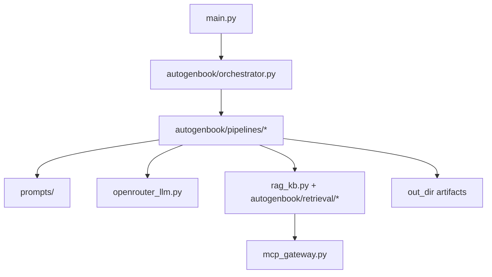
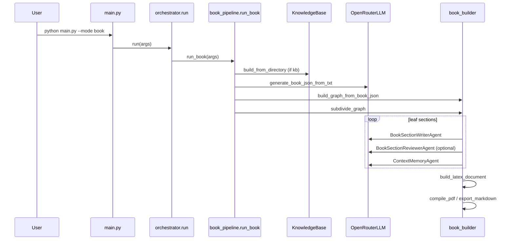

# Architecture

## High-level overview

The CLI (`main.py`) parses arguments, creates a `RunContext`, and dispatches to a mode-specific pipeline via the orchestrator. (`main.py:parse_args`, `main.py:main`, `autogenbook/state.py:RunContext`, `autogenbook/orchestrator.py:run`)

Each pipeline orchestrates prompt loading, retrieval, section generation, and output assembly. (`autogenbook/pipelines/*`, `autogenbook/prompts/*_loader.py`, `book_builder.py:generate_contents`, `autogenbook/retrieval/manager.py:RetrievalManager`)

## Component breakdown

### CLI and orchestration

- Argument parsing and defaults are defined in `main.py:parse_args`. (`main.py:parse_args`)
- Mode dispatch happens in `autogenbook/orchestrator.py:run`. (`autogenbook/orchestrator.py:run`)

### Pipelines

- Book: `autogenbook/pipelines/book_pipeline.py:run_book`. (`autogenbook/pipelines/book_pipeline.py:run_book`)
- Paper: `autogenbook/pipelines/paper_pipeline.py:run_paper`. (`autogenbook/pipelines/paper_pipeline.py:run_paper`)
- Scientist: `autogenbook/pipelines/scientist_pipeline.py:run_scientist`. (`autogenbook/pipelines/scientist_pipeline.py:run_scientist`)
- Proposal: `autogenbook/pipelines/proposal_pipeline.py:run_proposal`. (`autogenbook/pipelines/proposal_pipeline.py:run_proposal`)
- Reviewer: `autogenbook/pipelines/reviewer_pipeline.py:run_reviewer`. (`autogenbook/pipelines/reviewer_pipeline.py:run_reviewer`)

### Agents and schemas

- Agents build prompts and validate outputs against Pydantic schemas, with optional JSON repair. (`autogenbook/agents/base.py:BaseAgent`, `autogenbook/schemas/*`, `autogenbook/schemas/validate.py`)

### Retrieval and KB

- Local KB uses BM25 over chunked documents. (`rag_kb.py:KnowledgeBase`)
- Retrieval normalizes items into `RetrievalItem` with stable IDs for citations. (`autogenbook/retrieval/manager.py:RetrievalManager`, `autogenbook/retrieval/types.py:RetrievalItem`)
- Web retrieval uses MCP gateway tools and/or Tavily. (`autogenbook/retrieval/mcp_papers.py:MCPPaperRetriever`, `autogenbook/retrieval/tavily.py:TavilyRetriever`, `mcp_gateway.py:MCPGatewayClient`)

### Output assembly

- Book assembly uses `book_builder.build_latex_document`; paper/scientist use `_build_paper_latex`. (`book_builder.py:build_latex_document`, `autogenbook/pipelines/paper_pipeline.py:_build_paper_latex`, `autogenbook/pipelines/scientist_pipeline.py:_build_paper_latex`)
- PDF compilation uses `lualatex` via `book_builder.compile_pdf`. (`book_builder.py:compile_pdf`)
- Markdown export uses `latex2markdown` via `book_builder.export_markdown`. (`book_builder.py:export_markdown`)

### Audit and logging

- LaTeX auditing detects unknown cites, missing figures, and numeric evidence gaps. (`autogenbook/audit/latex_auditor.py:audit_latex`)
- Run metadata and LLM usage are written to `run_meta.json` and `llm_usage.jsonl`. (`autogenbook/llm_usage.py:write_run_meta`, `autogenbook/llm_usage.py:log_usage`)

## Data flow and control flow

### Component diagram



Sources: `main.py:main`, `autogenbook/orchestrator.py:run`, `autogenbook/pipelines/*`, `openrouter_llm.py:OpenRouterLLM`, `rag_kb.py:KnowledgeBase`, `autogenbook/retrieval/manager.py:RetrievalManager`, `mcp_gateway.py:MCPGatewayClient`, `autogenbook/state.py:RunContext`

### Sequence diagram (book mode)



Sources: `main.py:main`, `autogenbook/orchestrator.py:run`, `autogenbook/pipelines/book_pipeline.py:run_book`, `rag_kb.py:KnowledgeBase.build_from_directory`, `book_builder.py:generate_book_json_from_txt`, `book_builder.py:build_graph_from_book_json`, `book_builder.py:subdivide_graph`, `book_builder.py:generate_contents`, `autogenbook/agents/*`, `book_builder.py:build_latex_document`, `book_builder.py:compile_pdf`, `book_builder.py:export_markdown`

### Deployment diagram (logical)

```mermaid
graph LR
  Local[Local machine]
  Local -->|HTTP| OpenRouter[OpenRouter API]
  Local -->|HTTP (optional)| MCP[MCP Gateway]
  Local -->|HTTP (optional)| Tavily[Tavily Search]
```

Sources: `openrouter_llm.py:OpenRouterLLM`, `mcp_gateway.py:MCPGatewayClient`, `autogenbook/retrieval/tavily.py:search_web`

## Concurrency model

All pipelines run synchronously and sequentially; there are no explicit threads or async tasks in the core loops. (`autogenbook/pipelines/*`, `book_builder.py:generate_contents`)

Subprocesses are used for LaTeX compilation and for scientist experiments. (`book_builder.py:compile_pdf`, `autogenbook/pipelines/scientist_pipeline.py:_run_experiment`)

## State and persistence

- Run context tracks `run_id`, output paths, and is written to `run_meta.json`. (`autogenbook/state.py:RunContext`, `autogenbook/llm_usage.py:write_run_meta`)
- Book/paper structure graphs are stored as JSON for resume. (`autogenbook/graph/doc_graph.py:save_graph_json`)
- Section files are written under `out_dir/sections/`. (`book_builder.py:generate_contents`, `autogenbook/pipelines/paper_pipeline.py:run_paper`)

## Error handling

Pipelines return non-zero exit codes for missing inputs or audit failures and propagate exceptions for unexpected errors. (`autogenbook/pipelines/book_pipeline.py:run_book`, `autogenbook/pipelines/paper_pipeline.py:run_paper`, `autogenbook/pipelines/proposal_pipeline.py:run_proposal`)

## Web service layer (`api/`)

The CLI described above is also wrapped by a separate FastAPI service (`api/core`, `api/domain`, `api/application`, `api/infrastructure`, `api/presentation`, `api/worker`) plus a React/TanStack frontend (`app/`), run together via Docker Compose. The worker invokes the same CLI (`main.py`) as a subprocess per generation run rather than importing pipeline code directly, so this layer adds a service boundary around the CLI without changing the architecture above it. This is a distinct architecture from — and not covered further by — this document; see `docs/WEB_API_REFERENCE.md` for the HTTP API/worker design and `docs/OPERATIONS.md` for the Compose service topology.

## Extension points

- Add a new mode by creating a pipeline module, registering it in the orchestrator, and adding CLI flags. (`autogenbook/orchestrator.py:run`, `main.py:parse_args`)
- Add or edit prompt packs by editing files under `prompts/<mode>` and loader maps. (`autogenbook/prompts/*_loader.py`, `autogenbook/smoke_prompts.py`)
- Add new schemas for agent outputs under `autogenbook/schemas` and wire them into agents. (`autogenbook/agents/base.py:BaseAgent`, `autogenbook/schemas/*`)
